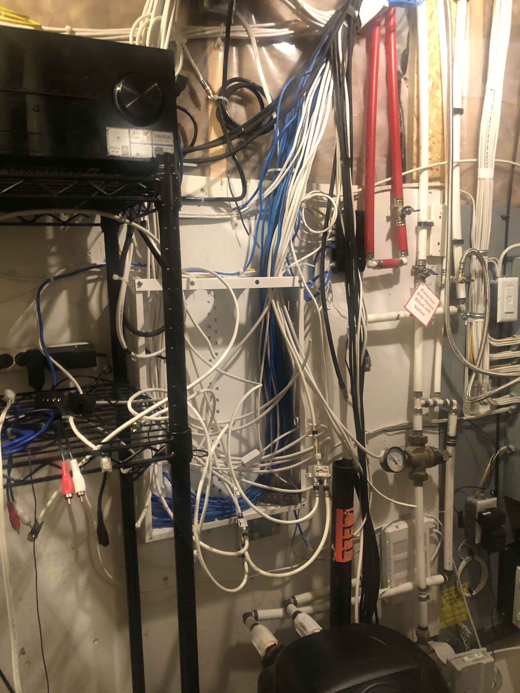

I know it is almost cliché at this point for game developers to say they like working within creative limitations like restricted palettes or constraints of old hardware and for years I thought I understood that. It was only recently that it really clicked for me.

I have been mulling over a much larger game project for a while which has been going a lot slower than I would have hoped. The scope is increasing and I am still unsure what the actual gameplay mechanics will be. Again, more game development clichés.

At this year's E3, the [Playdate Console](https://play.date) got announced. Some people reacted by saying it was overpriced, that it would be a dead end project in six months and that it could not possibly compete with the price of a used Nintendo Switch (odd comparison but sure). Others reacted by saying games are art and this is a niché product for those who understand that this art can be expressed in different forms. I sided with the second point of view.

I was also delighted to see that [Lukas Pope](https://dukope.itch.io/mars-after-midnight/devlog/261758/mars-after-midnight) of Papers Please fame had already announced a game for it. I really enjoy Lukas' work particularly [The Return of the Obra Dinn](https://store.steampowered.com/app/653530/Return_of_the_Obra_Dinn/) and even his lesser known game jam games like [The Sea Has No Claim](https://dukope.com/sea/play.html). His [devlogs](https://forums.tigsource.com/index.php?topic=29750) are also [incredibly detailed](https://forums.tigsource.com/index.php?topic=40832.0) and [fun to read](https://dukope.itch.io/mars-after-midnight/devlog/263965/making-martian-faces). I wish I could make a game as clever as some of the ones he has come up with. He really does understand gameplay like so few people do.

That announcement faded and I continued with life. I recently bought my first house and one of my projects has been organizing and figuring out this mess of cables that the previous home owner left me with.

> There are two dozen Cat5 cables, 6-7 HDMI cables, more than a dozen speaker wires, 3 subwoofer cables, a handful of coaxial cables for TV and a home phone cable (which I will probably never use).

It has been a multi-day project so far but it is starting to make sense. It's actually kind of fun. The other day whilst finding even more Cat5 cables and determining where in the house they went to, I thought this might actually make a fun game idea.

There are so many different challenges this project has presented so far already: cables without connectors, dozens of unlabelled ports around the house, miswired cables, cables requiring different wiring at each end, different types of cables, cables getting stripped and repurposed for other uses. I could take each of these different problems and teach them to the player gradually until building up to a project as complex as the one in my house.

And then the Playdate came back to mind. That crank. That crank could be such a neat physical way to reinforce this mechnical process. Opening up a panel to see what connections lay behind it by pushing the crank in a lifting motion away from you, clipping off wires with a downward guillotine motion towards you, unscrewing a panel with continuous rotations of the crank. The ideas started flowing. This was good, I hadn't felt inspired like this in a long while. It started making me think of the ["hacking" actions](https://www.youtube.com/watch?v=wBMFBDDaEQc) in Grand Theft Auto: Chinatown Wars on the DS.

Then the aesthetic. We are limited to one bit graphics. Something Papers Please-like or Obra Dinn inspired with a darker atmospheric vibe. An old dystopian multi-level building and you start in the basement working your way through it. I could build some background lore into the building. I could invent connection types and machines. I could create manuals and scraps of letters with backstory. This then started setting the tone for music ideas in my head. Perhaps something horror-like gets discovered later. Maybe a darker story lies in these walls.

But the crank wasn't the only driving force behind this decision. I needed something more and I found the answer in the specs for the Playdate...the 3-axis accelerometer. I could build a faux-AR experience requiring the user to move the Playdate around them to look around the room they are currently in in-game. That combined with this mechanical crank could really create something immersive. Maybe I could finally dive into that old school raycaster I have wanted to revisit for a while.

Needless to say, I'm sold. I have an idea. I feel motivated and inspired. I have no desire to make money off of this unlike my other game idea. All I care about now is this quirky indie game idea like what I used to enjoy back in college. After years in industry, it feels like I am coming back to my roots. And I get to do it in C!

I'm also writing again as I'm sure you've worked out by now. I always wanted my blog to be about technical pieces and not opinion bits or the state of things which is why I deleted my old one. This will just be about code, art and music. Don't expect anything else from me. And yes I just used the Gatsby starter blog project. Writing blog software isn't as interesting as games to me.

Thanks for reading!

Rob
